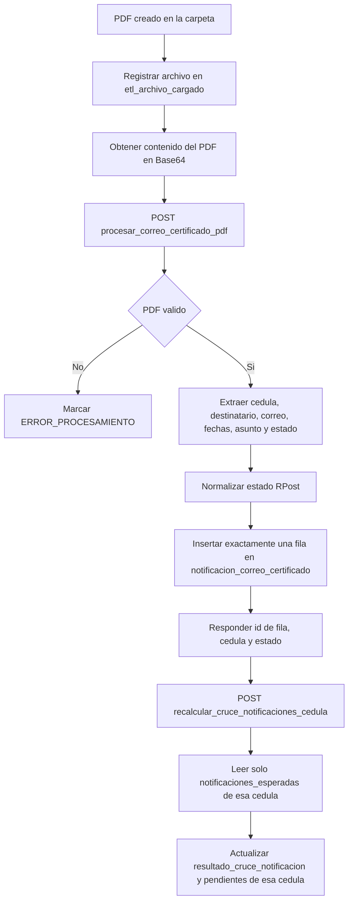

# Ingesta de PDF de correo certificado

## Flujo



La carga del PDF no ejecuta el cruce. El segundo endpoint exige una cedula y no
ejecuta el procedimiento global de resumen por defecto.

## Primera llamada: cargar un PDF

Ruta: `POST /api/procesar_correo_certificado_pdf`

```json
{
  "id_archivo": 9001,
  "tipo_archivo": "CORREO_CERTIFICADO_PDF",
  "nombre_archivo": "36 T COMUNICACION DICTAMEN PERSONA EJEMPLO CC 12345678 AFP.pdf",
  "ruta_sharepoint": "/Documentos/Correos certificados",
  "identifier": "identificador-del-elemento",
  "file_content_base64": "JVBERi0xLjQ..."
}
```

La respuesta incluye `id_notificacion_correo`, `cedula_normalizada`,
`tipo_destinatario_detectado`, `estado_correo` y `nombre_archivo`.

## Segunda llamada: recalcular una cedula

Ruta: `POST /api/recalcular_cruce_notificaciones_cedula`

```json
{
  "cedula_normalizada": "12345678",
  "solo_pendientes": false,
  "fuente_cruce": "FULL",
  "refrescar_resumen": false
}
```

`solo_pendientes` debe permanecer en `false` para corregir cruces anteriores de
esa cedula. `refrescar_resumen=false` evita llamar el procedimiento global y
costoso; el resumen puede actualizarse posteriormente mediante su ejecución
programada.

## Preparacion de base de datos

Antes del despliegue debe ejecutarse
`sql/migrations/20260804_add_nombre_archivo_correo_certificado.sql` para agregar
la columna `nombre_archivo`.

Headers para ambas llamadas:

- `Content-Type: application/json`
- `x-functions-key: <clave de la funcion>`
